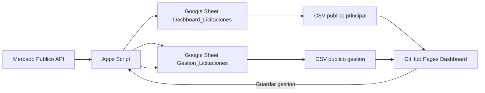

# Mercado Publico Dashboard

<p align="center">
  
</p>

<p align="center">
  
  
  
  
</p>

<p align="center">
  
  
  
  
</p>

## 1) Inicio del proyecto

Este proyecto nace para centralizar y automatizar el seguimiento de licitaciones de Mercado Publico en una sola plataforma operativa.

Objetivos iniciales:

- Cargar licitaciones de forma automatica desde API.
- Tener un panel web simple, rapido y accesible para equipo comercial.
- Guardar gestion comercial por ID de licitacion.
- Evitar trabajo manual repetitivo en hojas sueltas.

## 2) Desarrollo del proyecto

Durante el desarrollo se consolidaron tres capas:

### Capa de datos (Google Sheets)

- Hoja principal: Dashboard_Licitaciones
- Hoja de gestion: Gestion_Licitaciones
- Hoja de trazabilidad: Logs

### Capa backend (Google Apps Script)

Responsabilidades principales:

- Carga por fecha de nuevas licitaciones publicadas.
- Enriquecimiento por ID para completar campos faltantes.
- Endpoints Web App para lectura/escritura de gestion.
- Triggers de horario operacional y tareas de mantenimiento.

### Capa frontend (GitHub Pages)

- Dashboard en HTML + CSS + JS.
- Filtros, busqueda, orden, paginacion.
- Vistas: Tarjetas, Lista (DataTable), Kanban.
- Modal de detalle con edicion de gestion.
- Exportacion a Excel.

## 3) Estado final actual (produccion)

### Sitio publicado

- URL publica: https://espex-ti.github.io/Mercado-Publico/

### Fuentes CSV publicadas

- CSV principal (Dashboard_Licitaciones):
  - https://docs.google.com/spreadsheets/d/e/2PACX-1vTFm45Y6dS_yQGBtyYW0Zql9mxTaasWeTk0T_IxU9Esr0i-yGhGmHygxDb3psjrVJTVnEimAAAhQoMd/pub?gid=767150855&single=true&output=csv
- CSV gestion (Gestion_Licitaciones):
  - https://docs.google.com/spreadsheets/d/e/2PACX-1vTFm45Y6dS_yQGBtyYW0Zql9mxTaasWeTk0T_IxU9Esr0i-yGhGmHygxDb3psjrVJTVnEimAAAhQoMd/pub?gid=1084871879&single=true&output=csv

### Web App Apps Script

- URL Web App:
  - https://script.google.com/macros/s/AKfycby6th-WROi9ihiKtOKHCMOVrtWnRPumEqgAq8tB0ExwgePeFq2flr8FnUOZ3N-fgTgI/exec

## Arquitectura funcional



## Funcionalidades principales

### Panel

- KPI de monto total y estados de gestion.
- Filtros por texto, organismo, categoria, estado API, gestion, producto y fechas.
- Ordenamiento por dias, monto, nombre (asc y desc).
- Paginacion superior e inferior.

### Vistas

- Tarjetas: resumen comercial rapido.
- Lista: tabla con DataTables.
- Kanban: Sin Evaluar, Descartada, En Proceso, Aplicada.

### Gestion comercial

- Edicion de Visto, Estado, Responsable y Comentario desde modal.
- Persistencia local y sincronizacion al Web App.
- Estado default frontend: Sin Evaluar.

### Exportacion

- Exportacion de resultados filtrados a XLSX.

## Logica de limpieza y calidad de datos

### Limpieza de cerradas (actualizada)

La limpieza elimina licitaciones cerradas solo si su ID no existe en Gestion_Licitaciones.

Regla aplicada:

- Cerrada + sin registro en gestion -> se elimina.
- Cerrada + con registro en gestion -> se conserva.

Esto protege casos gestionados (por ejemplo: Descartada, En Proceso, Aplicada) y evita perdida de seguimiento.

### Verificacion fin de dia (20:00)

Se agrego una verificacion diaria que:

- Revisa licitaciones publicadas en el dia.
- Si Estado (texto) esta vacio, consulta detalle por ID y rellena campos faltantes.
- Si Estado ya tiene valor, pasa a la siguiente.

Objetivo: corregir automaticamente filas incompletas cuando hubo fallas durante la jornada.

## Triggers recomendados en produccion

### Minimos operativos

- actualizarDiasCierreDiario -> 06:00 diario
- activarTriggerCargaPorFecha -> 07:00 diario
- desactivarTriggerCargaPorFecha -> 18:00 diario

### Recomendados adicionales

- ejecutarVerificacionCamposFinDeDia -> 20:00 diario

### Opcionales segun estrategia

- completarDetalleIdsNuevosDeCargaFecha (si se desea refuerzo de detalle por cola de IDs nuevos)
- ejecutarLimpiezaLicitacionesCerradasSabado (limpieza semanal)

## Guia de despliegue rapido

1. Publicar CSV de Dashboard_Licitaciones y Gestion_Licitaciones.
2. Desplegar Apps Script como Web App (nueva version, acceso Anyone).
3. Actualizar en frontend:
   - CSV_URL
   - GESTION_PUBLIC_CSV_URL
   - APPS_SCRIPT_URL
4. Subir cambios al repo GitHub.
5. En GitHub Pages usar main / root.
6. Validar sitio publicado.

## Checklist de validacion post deploy

- El dashboard carga registros.
- Los filtros responden correctamente.
- El modal guarda gestion sin error.
- La gestion persiste tras refrescar.
- Kanban muestra las 4 columnas esperadas.
- Exportar Excel genera archivo valido.
- Triggers activos segun horario definido.

## Estructura sugerida de repositorio

```text
Mercado-Publico/
|- index.html            # Dashboard productivo
|- README.md             # Documentacion principal
|- docs/                 # (opcional) manuales tecnicos y funcionales
```

## Roadmap recomendado

- Versionar cambios de esquema de datos (migraciones de columnas).
- Agregar tablero de salud operacional (estado de triggers y ultima corrida).
- Integrar alertas por fallo critico en trigger.
- Incorporar pruebas de regresion para filtros y reglas de negocio.

---

<p align="center">
  
</p>
